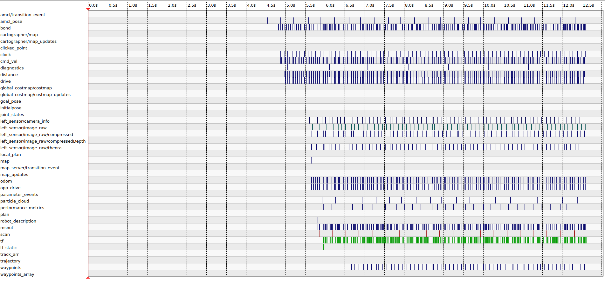

# Race Evaluation & Metrics Visualization
## Prerequisites

Before running the metric visualization tools, ensure the following components are properly installed and configured:

- **Ubuntu 22.04 LTS**
- **ROS 2 Humble** (`echo $ROS_DISTRO` -> `humble`)
- **rqt**
- A working Gazebo simulation or full-strack F1Tenth lanch that publishes topics such as:
    - `/odom`
    - `/cmd_vel`
    - `/scan`
- Optionally, ensure **rosbag2** is installed to record and replay telemetry data

## Setup Instructions
1. Launch the Simulation
- Start the full F1Tenth stack
```bash
ros2 launch rtec_vehicle_sim all.launch.py
```
2. Open RQT
- In a new terminal:
```bash
rqt
```
- Once open, go to:
    - **Plugins** -> **Topics** -> **Message Publisher** to send test commands
    - **Plugins** -> **Visualization** -> **Logging** -> **Bag**
        - Hit the record icon, and select any topics to monitor
### Example RQT Log
To ensure RQT is monitoring data correctly, the provided screenshot displays what a few seconds of letting our simulation run with RQT logging and all topics selected:

## Verification
To confirm setup success:
- RQT launches without errors
- RQT can send messages through the message publisher correctly
- RQT can log topics to a .db3 file 
